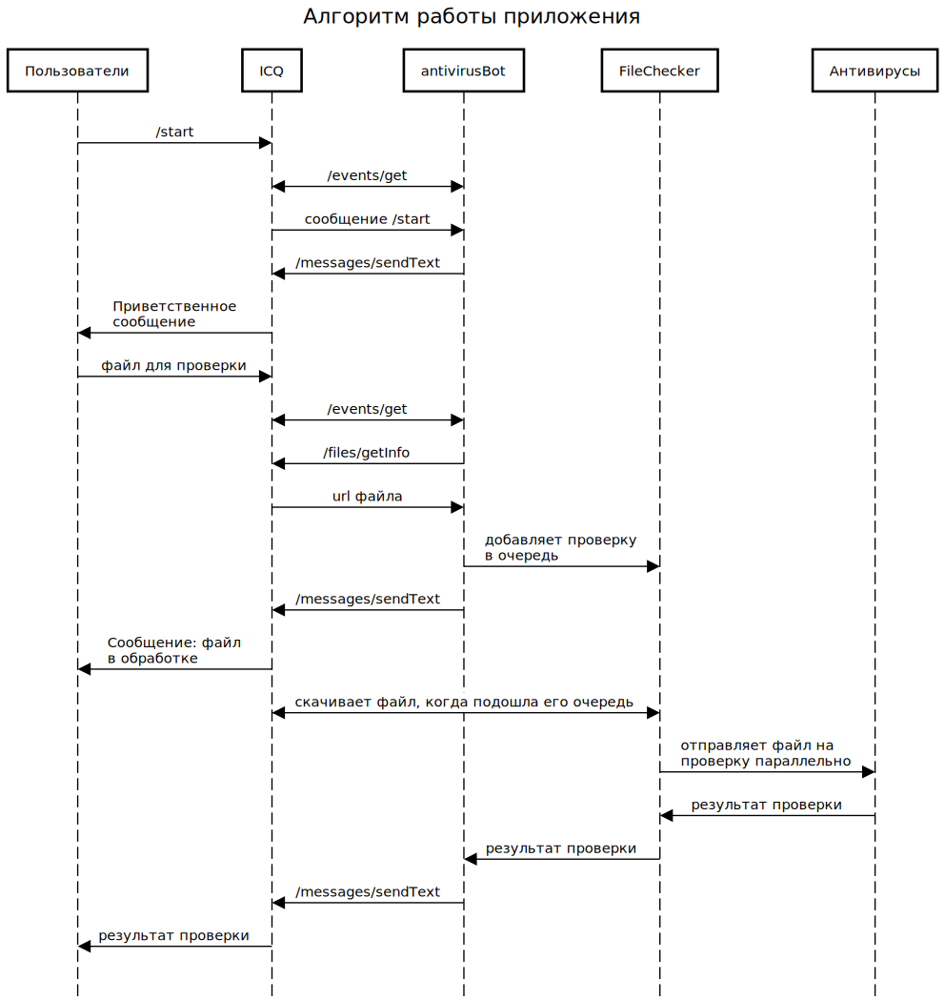

Антивирус-бот для ICQ
=====================

Выполнен Жердевым Иваном в рамках конкурса ICQ ботов Mail.ru.
Антивирус-бот проверяет файлы пользователей на наличие угроз. 

Имя бота в ICQ: @antivirus_bot

Используются антивирусы:

+ [ClamAV](https://www.clamav.net/)

Используются технологии:

+ [go](https://golang.org/)
+ [bot-golang](https://github.com/mail-ru-im/bot-golang) - для работы с API ICQ New
+ [logrus](https://github.com/sirupsen/logrus) - логирование
+ [docker](https://www.docker.com/) - запуск в контейнерах
+ [aws](https://aws.amazon.com) - работает в облаке Amazon Web Services

Алгоритм работы приложения
--------------------------

AntivirusBot обрабатывает запросы пользователей параллельно.
FileChecker скачивает файлы на проверку в порядке очереди,
проверку в антивирусах осуществляет параллельно. 
Логи сохраняются в директории согласно config.json. 



Запуск приложения
-----------------

Склонируйте репозиторий, в корне репозитория разместите конфигурационный файл config.json:

```
{
    "IcqToken": "ваш icq api токен",
   
    "FileBufferSize" : максимальный_размер_очереди (100),
    "FileMaxSize": максимальный_размер_файла (50000000),
    "DownloadTimeout": максимальное_время_загрузки_файла (30),
   
    Путь к логам:
    "BotLogDir": "logs/bot",
    "CheckerLogDir": "logs/checker",
    "AdminLogDir": "logs/admin",
    "FilesDir": "files", <- сюда будут скачиваться файлы на проверку
   
    Настройка администрирования:
    "AdminHost": "0.0.0.0", хост на котором будет запущен бот
    "AdminShutdownPath": "/admin/shutdown",
    "AdminPort": "8085", порт должен совпадать с тем, который открывается в docker-compose.yml
    "AdminToken": "ваш собственный админский токен",
    "AdminTimeout": таймаут_для_админки
}
```

Для запуска выполните в директории deployments/docker/ команду: 

```docker-compose up --build --abort-on-container-exit```

Для остановки бота сделайте POST запрос на admin/shutdown с телом:
```
{
    "AdminToken": "ваш собственный админский токен"
}
```

Расширение приложения
---------------------

Вы можете легко добавить поддержку нового антивируса в бот. 
Для этого реализуйте интерфейс antivirusClients.Client:
```
type Client interface {
	CheckFile(filePath string, checkResult chan *common.FileForCheck)
}
```

Здесь единственный метод CheckFile предназначен для проверки файла в антивирусе.
Реализацию следует разместить в пакете antivirusClients.

Клиенты-антивирусы добавляются в бот при инициализации приложения в application.NewApp. 
Пример:
```
myAntivirusCLient := antivirusClients.NewMyAntivirusClient()
_ = a.checker.AddAv(myAntivirusCLient)
```
Теперь каждый файл будет проходить проверку через соответствующий антивирус.
Сам антивирус лучше запускать в контейнере, внеся соответствующие изменения в docker-compose.yml.
